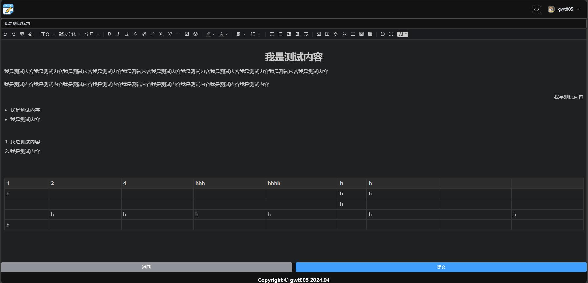
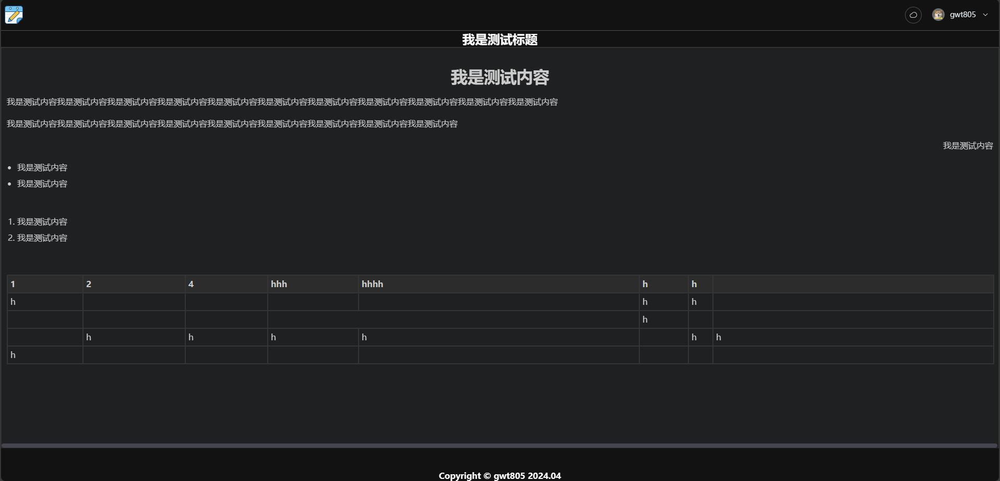

# 个人在线笔记

### 描述
> 简单粗暴的搭建个人在线笔记, 接入 Gitee 用户认证
 
功能比较简单, 只有 查看、编辑、删除
 
富文本编辑器用的是 [AiEditor](https://aieditor.dev/zh/config/base.html)
 
不支持表情保存？ 可能是我获取及保存的方式有点不对

### 环境搭建
> Python >=3.6
 
Node.js >= 18
 
Mysql

| server | client |
|--------|--------|
|· 先修改 config.json 中的配置信息|· 先修改 src/utils/axios/index.ts 的 baseURL 为 本地 ip:server port
|· client_id 和 client_secret 在 [gitee](https://gitee.com/oauth/applications) 创建一个应用后可拿到|· npm install
|· pip install -r requirements|· npm run dev # 开发环境
|· python manage.py makemigrations|· npm run build
|· python manage.py migrate|· node server.js
|· python manage.py runserver 0.0.0.0|

### Demo
| 首页 | 编辑/修改 | 查看 |
|:--------:|:--------:|:--------:|
|||
