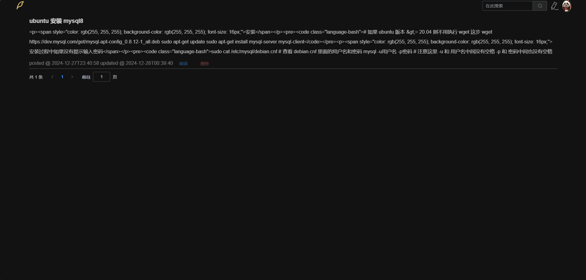
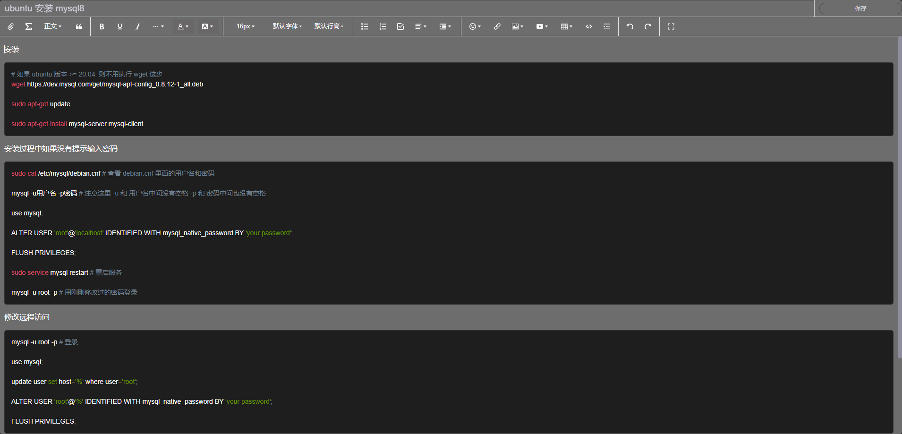
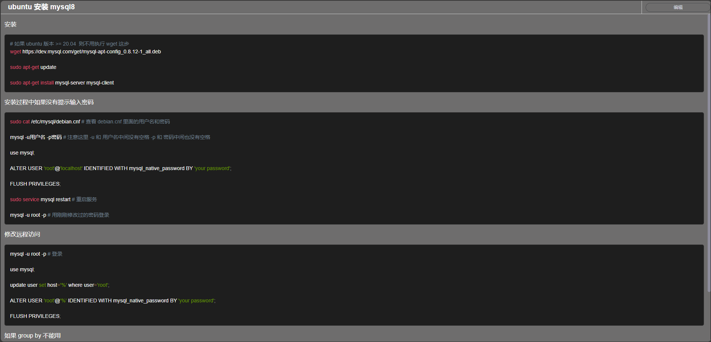

    
    
    
    
    

### 简介
本项目是一个简单的本地博客系统，前端使用Vue.js，后端使用 Robyn，数据库使用 MySQL，存储使用 MinIO，编辑器使用 wangEditor5， 虽然页面不是很好看，但是够用，哈哈哈

### 功能
- 用户注册、登录
- 文章发布、编辑、删除、预览、搜索

### 部署
    > docker-compose up -d

    > 访问 http://localhost:9000 创建一个名为 blog 的 bucket, 并将该 bucket 的 Access Policy 设置为 public
    
    > 访问 http://localhost:5173 开启笔记之旅

### Demo
|                     首页                 |                     编辑                  |                     预览                 |
|:---------------------------------------- |:-----------------------------------------|:-----------------------------------------|
||||
